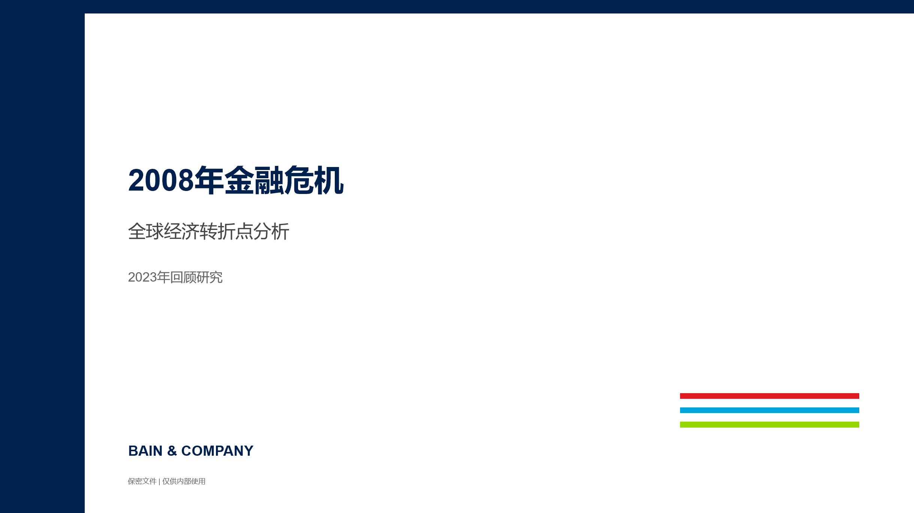
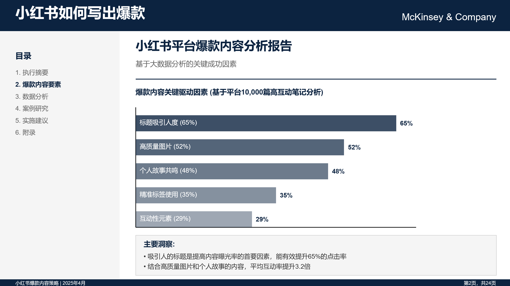

# MCP OKPPT Server

[切换语言 | Language: [中文](README.md) | English]

[](https://github.com/anthropics/anthropic-tools)

A Model Context Protocol (MCP) server tool specifically designed for inserting SVG images into PowerPoint presentations. It preserves the vector properties of SVGs, ensuring that images displayed in PowerPoint maintain high quality and scalability.

## Design Philosophy

This project is a creative solution enabling large language models (like Claude, GPT, etc.) to autonomously design PowerPoint presentations. By allowing AI to generate SVG images and using this tool to insert them full-screen into PPT slides, we've successfully achieved AI's complete control over PPT design without directly manipulating the complex PPT object model.

This approach offers three core advantages:
1. **Complete AI Control**: Fully leverages modern AI's graphic design capabilities while avoiding the complexity of PPT programming
2. **User Editable**: Office PowerPoint provides powerful SVG editing features, allowing inserted SVG elements to be edited, adjusted, and recolored like native PPT elements, enabling users to easily make secondary modifications based on AI-generated content
3. **Vector Quality**: Maintains high-quality scalable vector properties, ensuring presentation content remains clear and sharp at any size

This innovative approach uses SVG as a bridge between AI and PPT, guaranteeing both high design freedom and the practicality and maintainability of the final product.

## Features

- **Vector Preservation**: Inserts SVGs as true vector graphics into PPTX, ensuring high quality and scalability
- **Batch Processing**: Supports multiple SVG files and slides in a single operation
- **New Presentations**: Creates complete presentations directly from SVG files
- **Slide Copying & Replacement**: Intelligently copies SVG slides and replaces existing content
- **SVG Code Handling**: Supports direct creation of files from SVG code
- **Format Conversion**: Built-in SVG to PNG conversion functionality

## PPT Examples Showcase

Here are some examples of PPT slides generated using MCP OKPPT Server:


*Cover slide for a presentation on the 2008 Financial Crisis*


*Slide from a report on creating popular content on Xiaohongshu*

## Installation

### Method 1: Install from PyPI

```bash
# Using pip
pip install mcp-server-okppt

# Or using uv
uv pip install mcp-server-okppt
```

### Method 2: Configure Claude Desktop

Add the server configuration to your Claude Desktop config file:

**macOS**: `~/Library/Application Support/Claude/claude_desktop_config.json`  
**Windows**: `%APPDATA%\Claude\claude_desktop_config.json`

Add the following configuration:

```json
{
  "mcpServers": {
    "okppt": {
      "command": "uvx",
      "args": [
        "mcp-server-okppt"
      ]
    }
  }
}
```

### Method 3: Install from Source and Configure for Cursor Local Development

In Cursor IDE, set up the MCP server via local configuration file:

**Windows**: `C:\Users\username\.cursor\mcp.json`  
**macOS**: `~/.cursor/mcp.json`

Add the following configuration:

```json
{
  "mcpServers": {
    "okppt": {
      "command": "uv",
      "args": [
        "--directory",
        "D:\\local_project_path\\mcp-server-okppt\\src\\mcp_server_okppt",
        "run",
        "cli.py"
      ]
    }
  }
}
```

This configuration method is suitable for local development and testing, allowing you to point directly to your local code directory.

## Usage

### Using Claude Desktop

1. Install and configure Claude Desktop
2. Add the MCP server configuration above to the config file
3. Restart Claude Desktop
4. Use PPTX-related tools in your conversations

### Using MCP CLI for Development

```bash
# Run tests
mcp test server.py
```

## Available Tools

### 1. Insert SVG Image (insert_svg)

```python
def insert_svg(
    pptx_path: str,
    svg_path: List[str],
    slide_number: int = 1,
    x_inches: float = 0,
    y_inches: float = 0,
    width_inches: float = 16,
    height_inches: float = 9,
    output_path: str = "",
    create_if_not_exists: bool = True
) -> str
```

Inserts an SVG image into a specified position in a PPTX file.

**Parameters**:
- `pptx_path`: Path to the PPTX file
- `svg_path`: Path or list of paths to SVG files
- `slide_number`: Slide number to insert into (starting from 1)
- `x_inches`: X coordinate (inches)
- `y_inches`: Y coordinate (inches)
- `width_inches`: Width (inches)
- `height_inches`: Height (inches)
- `output_path`: Output file path
- `create_if_not_exists`: Whether to create the PPTX if it doesn't exist

**Returns**: Operation result message

### 2. List Directory Files (list_files)

```python
def list_files(
    directory: str = ".",
    file_type: Optional[str] = None
) -> str
```

Lists files in a directory.

**Parameters**:
- `directory`: Directory path
- `file_type`: File type filter, can be "svg" or "pptx"

**Returns**: List of files

### 3. Get File Information (get_file_info)

```python
def get_file_info(
    file_path: str
) -> str
```

Gets file information.

**Parameters**:
- `file_path`: Path to the file

**Returns**: File information

### 4. Convert SVG to PNG (convert_svg_to_png)

```python
def convert_svg_to_png(
    svg_path: str,
    output_path: Optional[str] = None
) -> str
```

Converts an SVG file to a PNG image.

**Parameters**:
- `svg_path`: Path to the SVG file
- `output_path`: Output PNG file path

**Returns**: Operation result message

### 5. Get PPTX Information (get_pptx_info)

```python
def get_pptx_info(
    pptx_path: str
) -> str
```

Gets basic information about a PPTX file.

**Parameters**:
- `pptx_path`: Path to the PPTX file

**Returns**: String containing file information and slide count

### 6. Save SVG Code (save_svg_code)

```python
def save_svg_code(
    svg_code: str
) -> str
```

Saves SVG code as an SVG file and returns the absolute path.

**Parameters**:
- `svg_code`: SVG code content

**Returns**: Operation result message and saved file path

### 7. Delete Slide (delete_slide)

```python
def delete_slide(
    pptx_path: str,
    slide_number: int,
    output_path: Optional[str] = None
) -> str
```

Deletes a specific slide from a PPTX file.

**Parameters**:
- `pptx_path`: Path to the PPTX file
- `slide_number`: Slide number to delete
- `output_path`: Output file path

**Returns**: Operation result message

### 8. Insert Blank Slide (insert_blank_slide)

```python
def insert_blank_slide(
    pptx_path: str,
    slide_number: int,
    layout_index: int = 6,
    output_path: Optional[str] = None,
    create_if_not_exists: bool = True
) -> str
```

Inserts a blank slide at a specified position in a PPTX file.

**Parameters**:
- `pptx_path`: Path to the PPTX file
- `slide_number`: Position to insert the slide
- `layout_index`: Slide layout index, default is 6 (blank layout)
- `output_path`: Output file path
- `create_if_not_exists`: Whether to create the PPTX if it doesn't exist

**Returns**: Operation result message

### 9. Copy SVG Slide (copy_svg_slide)

```python
def copy_svg_slide(
    source_pptx_path: str,
    target_pptx_path: str = "",
    source_slide_number: int = 1,
    target_slide_number: Optional[int] = None,
    output_path: Optional[str] = None,
    create_if_not_exists: bool = True
) -> str
```

Copies a slide containing an SVG image.

**Parameters**:
- `source_pptx_path`: Source PPTX file path
- `target_pptx_path`: Target PPTX file path
- `source_slide_number`: Source slide number to copy
- `target_slide_number`: Position to insert in target file
- `output_path`: Output file path
- `create_if_not_exists`: Whether to create the target PPTX if it doesn't exist

**Returns**: Operation result message

## Best Practices

### Recommended Methods for Replacing Slide Content

#### Method 1: Complete Replacement (Most Reliable)

```python
# Step 1: Delete the slide to be replaced
delete_slide(
    pptx_path="presentation.pptx",
    slide_number=3,
    output_path="temp_file.pptx"
)

# Step 2: Insert a blank slide at the same position
insert_blank_slide(
    pptx_path="temp_file.pptx",
    slide_number=3,
    output_path="temp_file2.pptx"
)

# Step 3: Insert the new SVG into the blank slide
insert_svg(
    pptx_path="temp_file2.pptx",
    svg_path=["new_content.svg"],
    slide_number=3,
    output_path="final_file.pptx"
)
```

## Important Notes

1. **Avoid Content Overlay**: Inserting SVGs directly into existing slides will cause new content to overlay the original content rather than replace it
2. **Batch Processing**: When batch inserting SVGs, the `svg_path` parameter must be in array format, even if there's only one file
3. **SVG Code Escaping**: When using `save_svg_code`, special characters (like "&") need to be properly escaped as "&amp;"
4. **File Paths**: Try to use English paths and avoid special characters in paths
5. **Check Results**: Always check the output file after each operation to confirm the modifications were successful

## Frequently Asked Questions

### Q: The SVG is inserted as a bitmap rather than a vector graphic?
A: Make sure to use the `copy_svg_slide` or `create_pptx_from_svg` functions, which are specifically designed to preserve the vector properties of SVGs.

### Q: How can I process multiple SVG files in batch?
A: You can use the `insert_svg` function and pass multiple SVG paths as a list, or use `create_pptx_from_svg` to create a presentation with multiple SVGs at once.

### Q: The filenames are becoming long and complex?
A: This happens because each operation adds a timestamp. We recommend using the "New File Method" to create the final file at once, or specifying a concise output filename in the last operation.

## Version Information

Current latest version: v0.1.9

View all versions and update information: [GitHub Releases](https://github.com/NeekChaw/mcp-server-okppt/releases)

## Acknowledgements

This project benefited from the excellent resource [Model Context Protocol(MCP) Quick Start Guide in Chinese](https://github.com/liaokongVFX/MCP-Chinese-Getting-Started-Guide) during its development. This resource provides comprehensive and clear guidance for MCP development, covering everything from basic concepts to practical deployment, greatly reducing the learning curve for developers learning the MCP protocol. Special thanks for the detailed examples and explanations regarding service configuration, tool development, and deployment processes, making valuable contributions to the development and popularization of the MCP ecosystem. We recommend this guide to all developers interested in MCP development, as it will help you quickly master the skills of developing and configuring MCP servers.

## Contribution Guidelines

Issues and pull requests are welcome at the [project repository](https://github.com/NeekChaw/mcp-server-okppt)! Here are some potential areas for improvement:

- Add support for more slide layouts
- Enhance SVG processing and compatibility
- Add progress reporting for batch SVG processing
- Improve error handling and diagnostics
- Add special handling for charts and tables

## License

This project is licensed under the MIT License. 